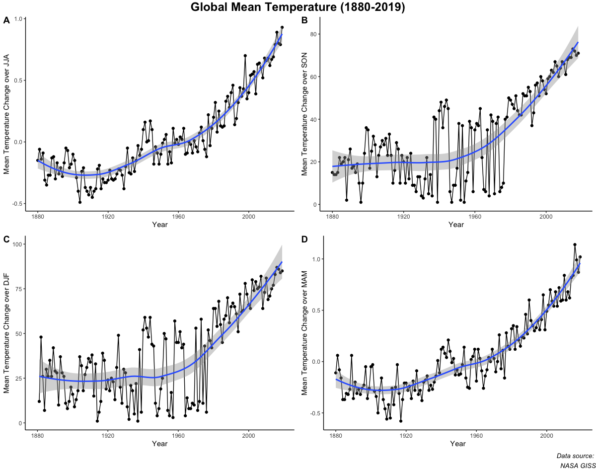

# Data Sonification

## Project Description

## Data Source
The data for this project was sourced from the [Land-Ocean Temperature Index](https://data.giss.nasa.gov/gistemp/) from NASA's Goddard Institute for Space Studies. This dataset records the annual global-mean change from 1880 to the present.

## Data Preprocessing
Initially the data ranged widely over positive and negative values. The data was first scaled linearly in order to be able to map to a 7 note scale. In order to give variation to note lengths, a z score was calcuated for each data point, exponentiated to keep the range from [0, infinity), and rounded to the nearest 0.25 value.

## Conversion to MIDI
Once preprocessed, each point (representing a mean change in global temperature per year) was converted to a MIDI note using [MIDITime](https://github.com/cirlabs/miditime) -- a library used to convert time series data into MIDI format.
