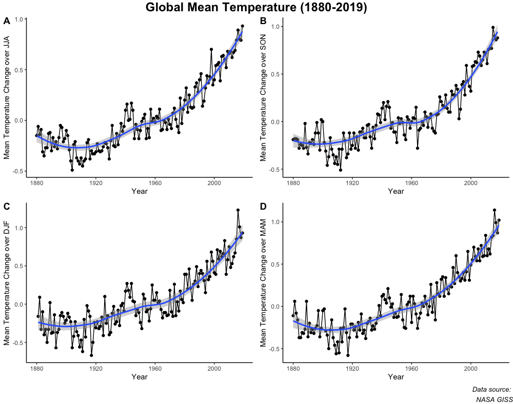

# Data Sonification

## Project Description

This project was inspired by the idea of habituation -- that after being exposed to a stimulus enough times you learn to ignore it. One such stimulus we've been exposed to in recent news cycles has been reports of a shocking rise in average global temperature. I wanted to explore a new way to express this alarming data that could circumvent habituation to the classic scatter/line graph.

## Data Source
The data for this project was sourced from the [Land-Ocean Temperature Index](https://data.giss.nasa.gov/gistemp/) from NASA's Goddard Institute for Space Studies. This dataset records the annual global-mean change from 1880 to the present. Below is a scatter/line graph of the data with LOESS trendline.

## Data Preprocessing
Initially the data ranged widely over positive and negative values. The data was first scaled linearly in order to be able to map to a 7 note scale. In order to give variation to note lengths, a z score was calcuated for each data point, exponentiated to keep the range from [0, infinity), and rounded to the nearest 0.25 value.

## Conversion to MIDI
Once preprocessed, each point (representing a mean change in global temperature per year) was converted to a MIDI note using [MIDITime](https://github.com/cirlabs/miditime) -- a library used to convert time series data into MIDI format.

## Harmonization
Once the data was converted to MIDI format, I then used the Polyphony Recurrent Neural Net from Google's [Magenta library](https://github.com/tensorflow/magenta) to harmonize. The Polyphony RNN is a LSTM that can model multiple simultaneous notes from a seed monophonic sequence. You can read more on the insiration behind the model [here](https://ismir2017.smcnus.org/wp-content/uploads/2017/10/156_Paper.pdf).

# Drawbacks
In order to get this project done within a week, I had to use the pretrained model provided with Magenta. This model was trained on the [JSB Chorales](https://github.com/czhuang/JSB-Chorales-dataset) and therefore produces harmonies in the style of Bach. Given more time, I would like to train a model on a more contemporary data set as I think it would further the poetic gesture.
